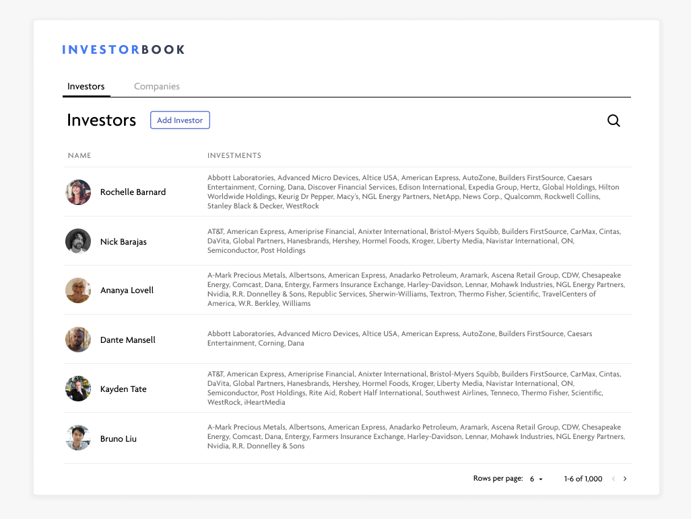

# InvestorBook

Welcome to InvestorBook, Inc! This is your first week at InvestorBook and you
are excited to build on top of the data. The dataset contains three tables:
Investors, Companies, and Investments.

## Your Task

You met with the CEO and promised to deliver a clean, fast UI for working with
the data -- in just four hours! The simplest option is to provide a basic CRUD
interface for the three tables, but if that looks too easy, the advanced version
is to build a spreadsheet-style interface.

### Basic Version

Implement this [design](https://www.figma.com/file/JJt9uopcl9K3WxPjCxT8V0/Investorbook?node-id=0%3A1) to add, view, edit, and delete records
in the three tables. 

### Advanced Version

Build a spreadsheet CRUD interface (similar to Google Sheets or Airtable) that
includes useful features like infinite scroll, collaborative editing (you can
try using Hasura Subscriptions for this), filtering, sort, search, the ability
to copy paste from another spreadsheet, etc. Use your own discretion to decide
which features to build in the allotted time. You can use any open source
packages that you'd like to pull in. This is a lot to build in four hours, so
it's reasonable to cut corners and focus on building a rough prototype.

## Submission

Fork this repository and send us a link to your fork after pushing your changes.

## Tables

- Investors
  - id
  - name
  - photo_large
  - photo_thumbnail
- Companies
  - id
  - name
- Investments
  - id
  - amount
  - investor_id
  - company_id

## GraphQL

You can use a GraphQL client library like apollo-client to connect to the
provided Hasura server, which adds a GraphQL API on top of PostgreSQL.
